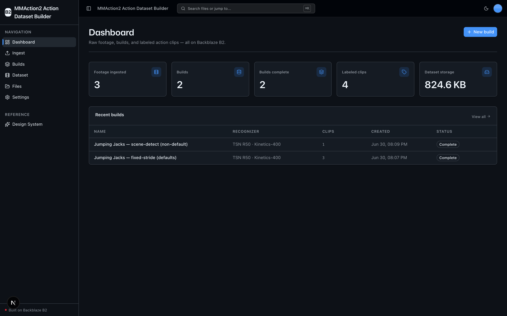
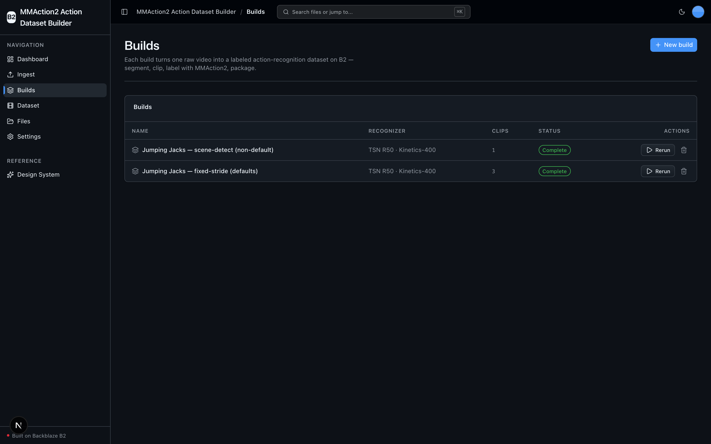
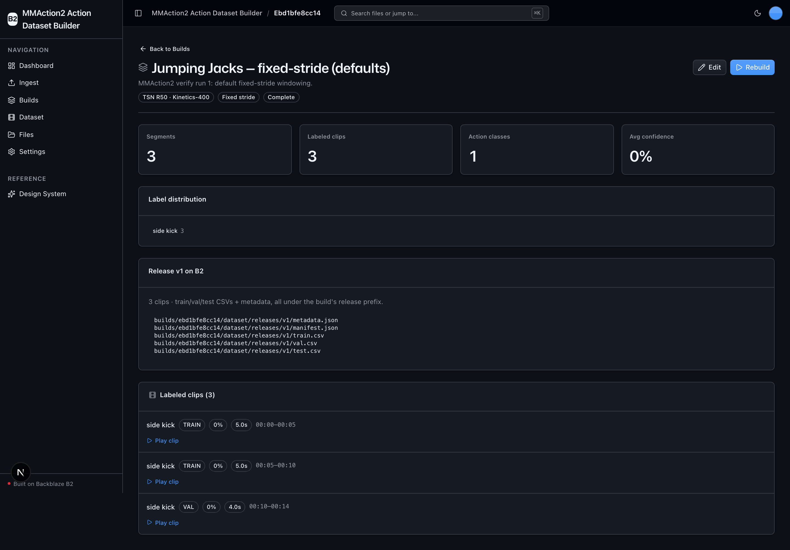
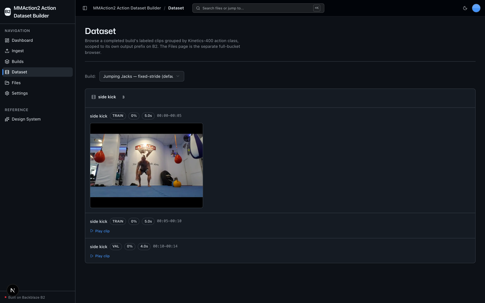

<!-- last_verified: 2026-06-30 -->
# MMAction2 Action Dataset Builder

Turn raw, long-form video into a **labeled action-recognition dataset** — entirely on **[Backblaze B2](https://www.backblaze.com/sign-up/ai-cloud-storage?utm_source=github&utm_medium=referral&utm_campaign=ai_artifacts&utm_content=b2ai-mmaction2-action-dataset-builder)**. Ingest broadcasts, fitness videos, or security footage to `raw/`, then run a **build**: the app segments each source video into candidate action intervals, trims them into short MP4 clips, runs **[MMAction2](https://github.com/open-mmlab/mmaction2)** recognizer inference locally to label every clip with a Kinetics-400 action + confidence, and packages versioned train/val/test split manifests ready for model training.

It runs on **local OSS only** — MMAction2 does the labeling on your own hardware. There's no second API key: **B2 credentials are the only thing you configure.**

**What you get out of the box:**
- A full dataset-building pipeline — ingest → segment → clip → **label (MMAction2)** → package — with live per-build progress
- B2 as the single storage layer for raw video, trimmed clips, annotation CSVs, and versioned dataset releases (S3-compatible API, custom user-agent)
- A dashboard of dataset metrics, a scoped clip explorer with in-browser video preview, and a full-bucket file browser
- FastAPI backend with strict layered architecture, structural tests, and heavy ML deps contained in the `repo/` layer
- Agent-optimized docs — point your AI coding agent at the repo and it can contribute immediately

## What it looks like

**Dashboard** — dataset metrics (footage ingested, builds, labeled clips, classes, B2 storage) with a recent-builds table.



**Builds** — every dataset build listed with its recognizer, clip count, and status, plus rerun and delete actions.



**Build detail** — per-build stats, label distribution, the versioned B2 release artifacts, and the labeled clips it produced.



**Dataset explorer** — a completed build's labeled clips grouped by Kinetics-400 action class, with in-browser video preview streamed from B2.



## How it works

A **Dataset Build** is the primary thing you manage. You create one, point it at an
ingested raw video, choose how to segment and label it, then run it:

1. **Ingest** — upload raw long-form video to B2 under `raw/` (the Upload page).
2. **Segment** — candidate action intervals are proposed by **fixed-stride windowing** (default) or **scene-detect** (content-aware, PySceneDetect); written to `builds/<id>/segments.json`.
3. **Clip** — each interval is trimmed to a short H.264 MP4 with the bundled ffmpeg (`imageio-ffmpeg`).
4. **Label** — **MMAction2's recognizer runs locally** on every clip, assigning a Kinetics-400 action label + confidence. Clips below the confidence threshold are dropped; the rest are routed to `dataset/clips/<class>/<clip_id>.mp4` and rows are written to `dataset/annotations/<split>.csv`.
5. **Package** — train/val/test split manifests plus a dataset `metadata.json` are written to `dataset/releases/<version>/`, ready for model training.

Every artifact for a build lives under its own `builds/<id>/` prefix, so deleting a
build is a single prefix-scoped cleanup that never touches other builds or `raw/`.

## Quick Start

You need: Node.js >= 20, pnpm >= 9, Python >= 3.11, and a free **[Backblaze B2 account](https://www.backblaze.com/sign-up/ai-cloud-storage?utm_source=github&utm_medium=referral&utm_campaign=ai_artifacts&utm_content=b2ai-mmaction2-action-dataset-builder)**.

### Get the code

```bash
git clone https://github.com/backblaze-b2-samples/mmaction2-action-dataset-builder.git
cd mmaction2-action-dataset-builder
```

### Setup

**1. Install dependencies**

```bash
pnpm install
```

**2. Set up the backend**

```bash
cd services/api
python -m venv .venv && source .venv/bin/activate
pip install -r requirements.txt
cd ../..
```

**3. Install the ML stack (MMAction2)**

The action-labeling step needs PyTorch + MMAction2. These are kept in a separate,
pinned requirements file so the API boots and tests run without the heavy install:

```bash
cd services/api && source .venv/bin/activate
pip install -r requirements-ml.txt
# mmcv ships as a compiled extension. If the pip wheel fails to build, use OpenMMLab's installer:
#   pip install -U openmim && mim install "mmcv>=2.1,<2.2"
cd ../..
```

> The labeler runs on **CPU by default** and auto-detects a GPU at runtime
> (CUDA → Apple MPS → CPU). `mmcv`'s MPS coverage is partial, so on Apple Silicon
> it effectively falls back to CPU — fine for the demo (keep `max_clips` modest).

**4. Add your B2 credentials**

```bash
cp .env.example .env
```

Open `.env`, then in the [Backblaze B2 dashboard](https://secure.backblaze.com/b2_buckets.htm?utm_source=github&utm_medium=referral&utm_campaign=ai_artifacts&utm_content=b2ai-mmaction2-action-dataset-builder):

1. **Create a bucket** and paste:
   - **Bucket Unique Name** → `B2_BUCKET_NAME`
   - The region embedded in the bucket's S3 endpoint (e.g. `us-west-004`) → `B2_REGION`
2. **Create an application key** with `Read and Write` permission and paste:
   - **keyID** → `B2_APPLICATION_KEY_ID`
   - **applicationKey** → `B2_APPLICATION_KEY` *(only shown once)*

The S3 endpoint is derived from `B2_REGION` as `https://s3.<region>.backblazeb2.com`.
Optionally set `B2_PUBLIC_URL_BASE` for public object URLs.

> Walkthroughs: [creating a bucket](https://www.backblaze.com/docs/cloud-storage-create-and-manage-buckets?utm_source=github&utm_medium=referral&utm_campaign=ai_artifacts&utm_content=b2ai-mmaction2-action-dataset-builder) · [creating app keys](https://www.backblaze.com/docs/cloud-storage-create-and-manage-app-keys?utm_source=github&utm_medium=referral&utm_campaign=ai_artifacts&utm_content=b2ai-mmaction2-action-dataset-builder).

**5. Run it**

```bash
pnpm dev
```

Frontend at `localhost:3000`, API at `localhost:8000`. Upload a short video on the
Upload page, then create and run a build. `pnpm dev` runs `pnpm doctor` first — a
preflight that catches the common setup gotchas (wrong Node/Python version, missing
venv, missing or placeholder `.env`, ports already taken).

## Core Features

- [Builds](docs/features/builds.md) — create, configure, run, inspect, edit, and delete a Dataset Build (the primary entity)
- [Ingest](docs/features/file-upload.md) — upload raw long-form video to B2 under `raw/`
- [Segmentation](docs/features/segmentation.md) — fixed-stride windowing or scene-detect candidate intervals
- [Clipping](docs/features/clipping.md) — trim + encode short MP4 clips with bundled ffmpeg
- [Labeling (MMAction2)](docs/features/labeling-mmaction2.md) — local Kinetics-400 recognizer inference per clip
- [Packaging](docs/features/packaging.md) — train/val/test split manifests + dataset metadata releases
- [Dataset Explorer](docs/features/dataset-explorer.md) — labeled clips grouped by action class with video preview (scoped to a build)
- [File Browser](docs/features/file-browser.md) — full-bucket browse with preview, download, delete
- [Dashboard](docs/features/dashboard.md) — dataset metrics across all builds
- [Design System](docs/design-system.md) — tokens, primitives, loaders, error/empty states. Live preview at `/design`.

## B2 storage layout

All access is via the **S3-compatible API** (no b2-native calls), with a custom
user-agent (`b2ai-mmaction2-action-dataset-builder`) and standard `B2_*` env vars.

```
raw/<video>                                         ingested source footage
builds/<id>/build.json                              build manifest + stats (sole state store; no DB)
builds/<id>/segments.json                           candidate-interval manifest
builds/<id>/dataset/clips/<class>/<clip_id>.mp4     trimmed, labeled clips
builds/<id>/dataset/annotations/<split>.csv         per-split annotation CSVs
builds/<id>/dataset/releases/<version>/             manifest.json, metadata.json, train/val/test.csv
```

## Tech Stack

- TypeScript, Next.js 16, React 19, Tailwind v4, shadcn/ui, Recharts
- TanStack Query — caching, dedup, retry for every fetch
- Python 3.11+, FastAPI, boto3, Pydantic v2
- **MMAction2** (action recognition), **PyTorch**, **PySceneDetect**, **imageio-ffmpeg**
- Backblaze B2 (S3-compatible object storage)
- pnpm workspaces (monorepo)

## Commands

| Command | What it does |
|---------|-------------|
| `pnpm dev` | Start frontend + backend |
| `pnpm dev:web` | Frontend only |
| `pnpm dev:api` | Backend only |
| `pnpm build` | Build frontend |
| `pnpm lint` | Lint frontend |
| `pnpm lint:api` | Lint backend (ruff) |
| `pnpm test:api` | Run backend tests |
| `pnpm check:structure` | Verify layering + SDK-containment rules |
| `pnpm test:e2e` | Playwright e2e tests (run `pnpm --filter @mmaction2-action-dataset-builder/web exec playwright install chromium` once first) |

## Documentation Map

| Doc | Purpose |
|-----|---------|
| [AGENTS.md](AGENTS.md) | Agent table of contents — start here |
| [ARCHITECTURE.md](ARCHITECTURE.md) | System layout, layering, data flows |
| [docs/features/](docs/features/) | Feature docs (builds, ingest, segmentation, clipping, labeling, packaging, explorer) |
| [docs/design-system.md](docs/design-system.md) | Design tokens, primitives, loader, error/empty states |
| [docs/app-workflows.md](docs/app-workflows.md) | User journeys |
| [docs/dev-workflows.md](docs/dev-workflows.md) | Engineering workflows and testing |
| [docs/SECURITY.md](docs/SECURITY.md) | Security principles |
| [docs/RELIABILITY.md](docs/RELIABILITY.md) | Reliability expectations |
| [docs/exec-plans/](docs/exec-plans/) | Execution plans and tech debt tracker |

## License

MIT License - see [LICENSE](LICENSE) for details.

## Claude Agent B2 Skill

Manage Backblaze B2 from your terminal using natural language (list/search, audits, stale or large file detection, security checks, safe cleanup).

Repo: [https://github.com/backblaze-b2-samples/claude-skill-b2-cloud-storage](https://github.com/backblaze-b2-samples/claude-skill-b2-cloud-storage)
